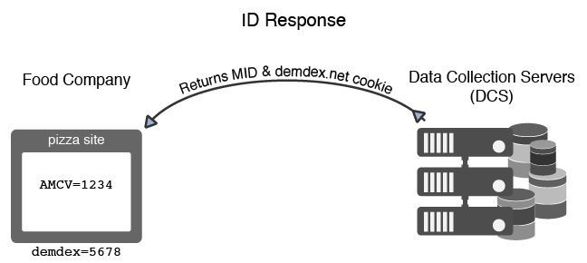
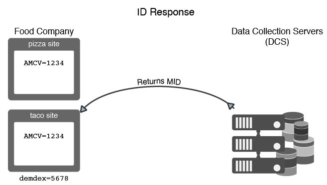

# Hoe de Dienst van de Identiteit van het Experience Cloud verzoekt en identiteitskaart plaatst{#how-the-experience-cloud-id-service-requests-and-sets-ids}

Een overzicht van het verzoek en het reactieproces van identiteitskaart Deze voorbeelden behandelen identiteitskaart taak op individuele plaatsen, over verschillende plaatsen, en voor plaatsen die door verschillende klanten van het Experience Cloud met hun eigen organisatie IDs worden beheerd.

>[!NOTE]
>
>Als u niet vertrouwd met bent hoe de Dienst van de Identiteit van het Experience Cloud tot bezoekersidentiteitskaart leidt, neem een ogenblik om [ Experience Cloud ](../introduction/cookies.md) te herzien.

## Experience Cloud-id aanvragen {#section-0b5e261fbd0547d9b9a1680e5ce536cc}

In de volgende voorbeelden ziet u hoe de id-service de bezoeker-id van het Experience Cloud opvraagt en ontvangt. In deze voorbeelden worden twee fictieve bedrijven, de Food Company en de Sports Company, gebruikt om gegevensstromen voor identiteitsverzoeken en reacties aan te tonen. Elk bedrijf heeft een unieke organisatie-id van het Experience Cloud en heeft de ID-servicecode op al hun sites geïmplementeerd. Deze gebruiksgevallen vertegenwoordigen gegevensstromen voor een generische de dienstimplementatie van identiteitskaart zonder Analytics, erfenis IDs, of browsers die derdekoekjes blokkeren.

**Eerste verzoek**

In dit voorbeeld komt een nieuwe bezoeker naar de pizza-site die wordt beheerd door de Food Company. De Food Company heeft ID-servicecode op de website van de pizza. Wanneer de pizza-site wordt geladen, controleert de ID-servicecode of het AMCV-cookie zich in het pizza-domein bevindt.

* Als het AMCV-cookie is ingesteld, heeft de sitebezoeker een Experience Cloud-id. In dit geval houdt het cookie de bezoeker bij en deelt het gegevens met andere oplossingen voor Experiencen Cloud.
* Als het koekje AMCV niet wordt geplaatst, roept de de dienstcode van identiteitskaart een regionale [ server van de gegevensinzameling ](https://experienceleague.adobe.com/docs/analytics/technotes/rdc/regional-data-collection.html?lang=nl-NL) (DCS) bij `dpm.demdex.net/id` (zie ook, [ Begrijpende Vraag aan het Domein van de Index ](https://experienceleague.adobe.com/docs/audience-manager/user-guide/reference/demdex-calls.html?lang=nl-NL). De oproep omvat de organisatie-id voor de Food Company. De organisatie-id wordt ingesteld in de functie `Visitor.getInstance` van de ID-servicecode.

**Eerste reactie**

In de reactie retourneert de DCS de [!DNL Experience Cloud] ID (MID) en het demdex-cookie. De ID-servicecode schrijft de MID-waarde naar het AMCV-cookie. Bijvoorbeeld, zeg DCS een MID waarde van 1234 terugkeert. Het zou de cookie van AMCV als `mid|1234` worden opgeslagen en worden ingesteld in het pizza-domein van de eerste partij. Het demdex-cookie bevat ook een unieke id (noem het maar 5678). Deze cookie wordt ingesteld in het domein demdex.net van de derde, dat los staat van het pizza-domein.

Zoals u in het volgende voorbeeld zult zien, staat demdex ID en organisatie identiteitskaart de dienst van identiteitskaart toe om correcte MID tot stand te brengen en terug te keren wanneer onze bezoeker naar een andere plaats die tot het Bedrijf van de Levensmiddelen behoort.

## Verzoek en antwoord naar andere sites {#section-15ea880453af467abd2874b8b4ed6ee9}

In dit voorbeeld navigeert onze bezoeker van de Food Company naar de tacos-site vanuit de pizza-site. De Food Company heeft de dienstcode van identiteitskaart op de website van tacos. De bezoeker is nooit geweest bij de tacos-website.

Gezien deze omstandigheden is er geen AMCV-cookie op de tacos-site. De id-service kan de AMCV-cookie die op de pizza-site is ingesteld, niet gebruiken omdat deze specifiek is voor het pizza-domein. Dientengevolge, moet de dienst van identiteitskaart DCS roepen om een bezoekersidentiteitskaart te controleren en te verzoeken. In dit geval, omvat de vraag DCS de organisatieidentiteitskaart van het Bedrijf van het Levensmiddel *en* demdex identiteitskaart De demdex-id wordt opgehaald van de pizza-site en opgeslagen als een cookie van een derde onder het domein demdex.net.

Nadat het DCS de organisatie-id en de demdex-id ontvangt, wordt de juiste MID voor onze sitebezoeker gemaakt en geretourneerd. Omdat de MID wiskundig wordt afgeleid van de organisatie-id en de demdex-id, bevat het cookie van AMCV de MID-waarde, `mid = 1234` .

## ID-aanvragen van andere sites {#section-ba9a929e50d64b0aba080630fd83b6f1}

In dit voorbeeld verlaat onze bezoeker de sites van de Food Company en navigeert hij naar de voetbalsite van de Sports Company. Wanneer de bezoeker naar de voetbalsite komt, werkt het proces voor het controleren en aanvragen van id&#39;s op dezelfde manier als in de vorige voorbeelden wordt beschreven. Nochtans, omdat het Bedrijf van Sport zijn eigen organisatie identiteitskaart heeft, keert de dienst van identiteitskaart een verschillende MID terug. De nieuwe MID is uniek voor de domeinen die door Sports Company worden gecontroleerd en laat die onderneming bezoekersgegevens over oplossingen in volgen en delen [!DNL Experience Cloud]. De demdex-id blijft hetzelfde voor deze bezoeker, omdat deze in een cookie van een derde wordt opgenomen en in verschillende domeinen blijft bestaan.

